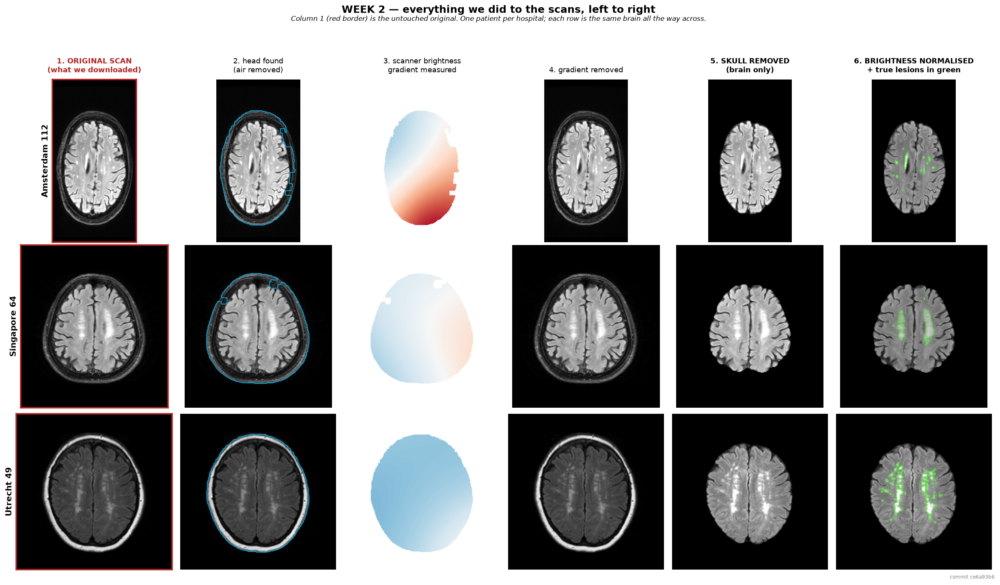
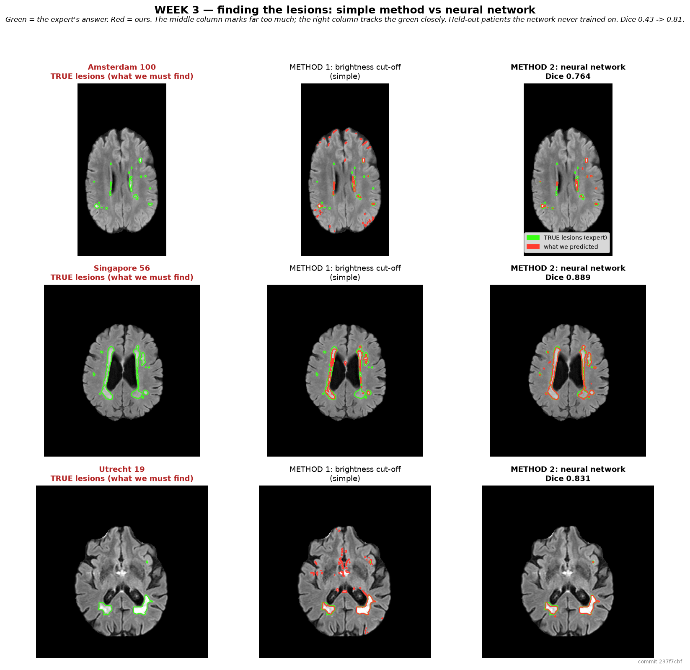
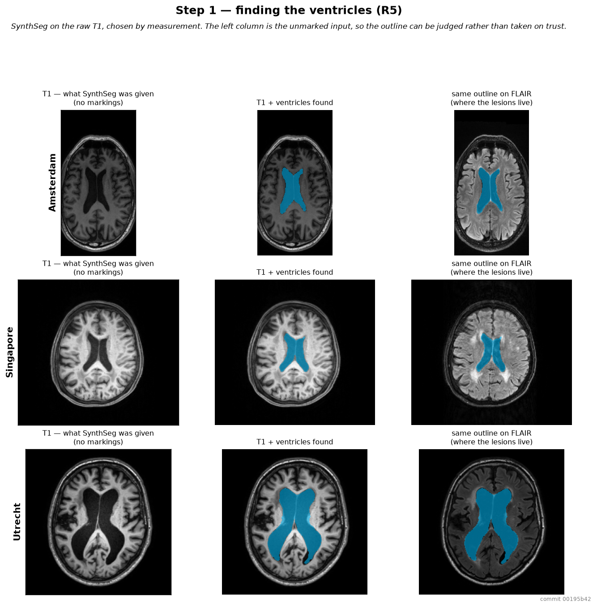
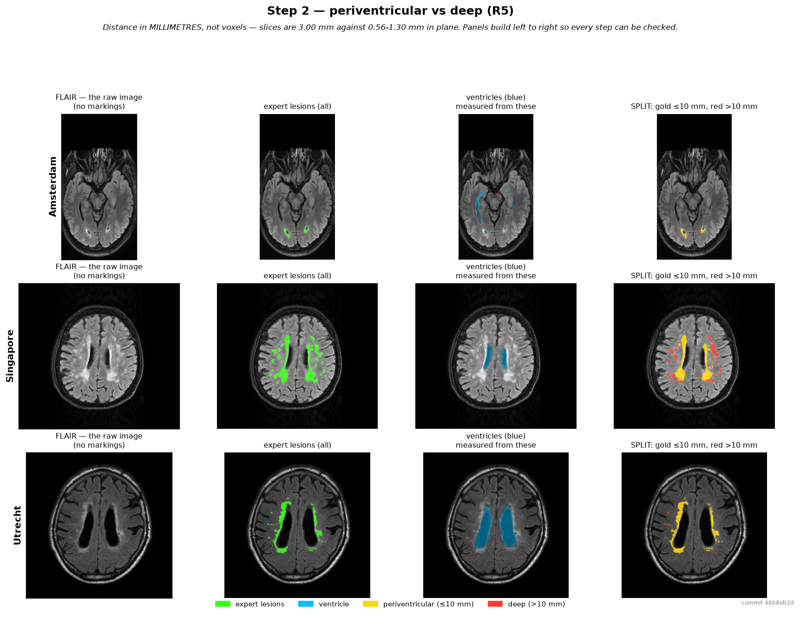
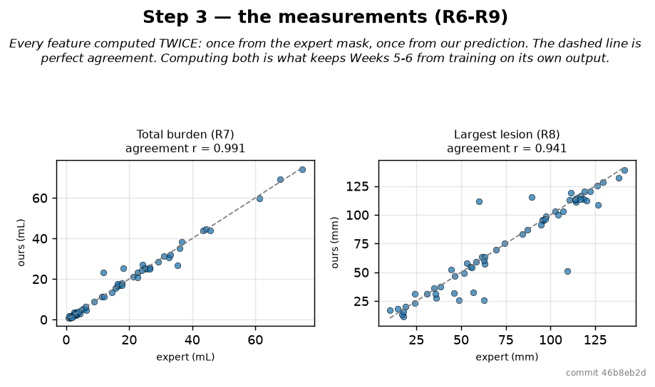

# White-Matter Hyperintensity Segmentation in Brain MRI

**BME 4408 — Medical Imaging**

Progress report · Weeks 1–4 complete

---

## What this project is trying to achieve

Find and measure **white-matter hyperintensities** (WMH) — patches of damaged
brain wiring that appear abnormally bright on FLAIR MRI. They are a standard
imaging marker of cerebral small-vessel disease, and their burden predicts
stroke risk and cognitive decline.

The pipeline has to do five things end to end:

1. **Pre-processing** the scans — skull-stripping, bias-field correction and intensity normalization
2. **Segmentation** of the lesions on FLAIR
3. **Labelling** each lesion as *periventricular* or *deep*
4. **Quantify** them — total count, total burden, largest lesion size, spread across
   hemispheres
5. **Classify** patients as mild / moderate / severe *(bonus)*

Finally, benchmark the result against the **MICCAI 2017 WMH Segmentation
Challenge** leaderboard.

### Requirements traceability

| # | Requirement | Delivered |
|---|---|---|
| R1 | Skull stripping | ✅ Week 2 |
| R2 | Intensity normalisation | ✅ Week 2 |
| R3 | Bias field correction | ✅ Week 2 |
| R4 | WMH segmentation on FLAIR | ✅ Week 3 |
| R5 | Periventricular vs deep labelling | ✅ Week 4 |
| R6 | Lesion count | ✅ Week 4 |
| R7 | Total lesion volume (burden) | ✅ Week 4 |
| R8 | Largest lesion — diameter **and** volume | ✅ Week 4 |
| R9 | Spatial distribution across hemispheres | ✅ Week 4 |
| R10 | Mild / moderate / severe classification *(bonus)* | Weeks 5–6 |
| R11 | Benchmarked against the Challenge dataset | Week 7 |

---

## The data

**MICCAI 2017 WMH Segmentation Challenge**

| | |
|---|---|
| **Source / download** | [doi.org/10.34894/AECRSD](https://doi.org/10.34894/AECRSD) — DataverseNL |
| **Licence** | CC BY-NC 4.0 (terms accepted at download) |
| **Citation** | Kuijf, Hugo, Matthijs Biesbroek, Jeroen de Bresser, Rutger Heinen, Christopher Chen, Wiesje van der Flier, Barkhof, Max Viergever, and Geert Jan Biessels. 2022. “Data of the White Matter Hyperintensity (WMH) Segmentation Challenge.” DataverseNL. · [doi:10.1109/TMI.2019.2905770](https://doi.org/10.1109/TMI.2019.2905770) |
| **Total subjects** | **170** (60 training + 110 sealed test) |
| **Per subject** | FLAIR, T1, and an expert-drawn lesion mask |
| **Cohort** | 70.1 ± 9.3 years, 50% male (cohort-level only; no per-subject demographics in the public release) |
| **Size on disk** | ~8.7 GB |

### Scanners and acquisition

| Split | Site | Scanner | N | In-plane (mm) | Slice (mm) |
|---|---|---|---|---|---|
| training | Utrecht | Philips Achieva 3T | 20 | 0.958 × 0.958 | 3.0 |
| training | Singapore | Siemens TrioTim 3T | 20 | 1.00 × 1.00 | 3.0 |
| training | Amsterdam | GE Signa HDxt 3T | 20 | ≈1.0–1.2 | 3.0 |
| test | Utrecht | Philips Achieva 3T | 30 | 0.958 × 0.958 | 3.0 |
| test | Singapore | Siemens TrioTim 3T | 30 | 1.00 × 1.00 | 3.0 |
| test | Amsterdam | GE Signa HDxt 3T | 30 | ≈1.0–1.2 | 3.0 |
| test | Amsterdam | GE Signa HDxt **1.5T** *(unseen in training)* | 10 | ≈1.3 × 1.3 | 3.0 |
| test | Amsterdam | Philips **PET/MR** *(unseen in training)* | 10 | 0.56 × 0.56 | 3.0 |

**Two facts that shaped every later decision:**

- **Slices are 3.0 mm apart while pixels within a slice are 0.56–1.30 mm** — up
  to a 5.4× difference. Every distance and volume calculation has to account for
  this or it is silently wrong.
- **Two of the five test scanners never appear in training.** The dataset is
  designed to test whether a method learned *what a lesion looks like* or merely
  *what one hospital's scans look like*.

### Labels and splits

- Masks use three values: `0` healthy, `1` WMH, `2` other pathology.
  The official scorer treats **label 2 as "don't care"** — neither rewarded nor
  penalised — and we match that exactly.
- **48 train / 12 validation / 110 sealed test.** Split by patient (never by
  slice), stratified by site, seeded and frozen before any image was viewed.
- **The 110 test subjects have not been opened.** They stay sealed until Week 7.

---

## Where we stand

| Method | Networks | Augmented | Tested on | Dice |
|---|---|---|---|---|
| Simple brightness cut-off *(baseline to beat)* | — | — | 12 held-out patients | 0.429 |
| Single neural network | 1 | no | 12 held-out patients | 0.806 |
| **Four networks + mirrored images ← current model** | **4, voted** | **yes** | **12 held-out patients** | **0.804** |
| Same method, trained without one hospital and tested on it | 1 per run | yes | a hospital never seen | 0.780 |

The top three rows are all tested on patients from the **same three hospitals**
the models trained on. The last row is a deliberately harder test — train on two
hospitals, hide the third, repeat three times — and it is our best estimate of
how the model will perform in Week 7, where two of the five scanners are ones
nobody has seen.

**Why does the current model score slightly below the single network?** Three
things changed at once between those rows, so they are not a like-for-like
comparison. Measured one at a time on identical patients:

| Change | On familiar scanners | On an unseen hospital |
|---|---|---|
| Scanner-simulating augmentation | −0.004 | **+0.041** |
| Combining four networks | +0.002 | — |
| Averaging in mirrored images | +0.001 | — |

The small drop is entirely the cost of augmentation, and it buys roughly ten
times as much on unfamiliar scanners — which is what the final evaluation
measures. Without it, the hidden-hospital score was only 0.738.

For context: two human experts marking the same brain typically agree at
**0.75–0.85**, and the challenge's winning entry scored **0.81**.

Full metrics for the current model on the 12 held-out patients: Dice: **0.8038**
lesion F1: **0.7623**
Hausdorff-95 4.39 mm
Absolute volume difference: 22.1%.

---

## The story so far

### Week 1 — Data acquisition

- **Downloaded and verified all 170 subjects**
  - Every file opened and checked: shapes, orientations, label values, no
    corrupt data — **170/170 passed**
  - Found the shipped documentation was wrong: it claims the 110 test subjects
    have no answer keys. **They do.** That upgraded our whole Week 7 plan from
    "compare to other teams' published numbers" to "score ourselves on the exact
    same patients as the competition"
- **Organised the metadata**
  - Built a master index: voxel spacing, site, scanner, orientation and lesion
    statistics for every subject
  - Froze the train/validation/test split before looking at any image
- **Built a synthetic test brain**
  - A fake volume with lesions at *exactly known* sizes and distances, so the
    code can be checked against an answer we chose
  - Catches the four bugs real MRI cannot test for: wrong voxel maths, lesion
    counting rules, left/right flips, millimetres-vs-voxels

### Week 2 — Pre-processing (R1, R2, R3)

Eight stages, each method chosen by **measurement** against a rule fixed *before*
the results were seen.



- **Separated head from air** — 3-class Otsu thresholding
  - The standard 2-class version failed on 1 patient in 60 (bright scalp pulled
    the cut-off above the brain, keeping only 25.6% of their lesions)
  - Final: **60/60 patients keep 100% of their lesions**
- **Corrected the scanner's uneven lighting (R3)** — N4 at 2 fitting levels
  - Swept 3 settings across 48 patients, 144 runs
  - The software default destroys **up to 32% of lesion contrast** on the sickest
    patients, silently — the image just looks nicer
  - We deliberately under-correct in exchange for never damaging lesions by >5%
- **Removed skull and scalp (R1)** — HD-BET
  - Four configurations measured; **100% of lesions retained on all 60**
- **Put every hospital on one brightness scale (R2)** — white-matter referencing
  - Healthy white matter = exactly 1.0 for every patient, so a lesion at 1.45
    means "45% brighter than this patient's own normal tissue"
- **Tested three noise filters and rejected all three**
  - The standard quality measure (SSIM) rated one filtered image 0.981 —
    "nothing changed" — while it had destroyed **399 lesions**
  - Lesson applied three more times since: *check the measure can see the
    failure you care about*

### Week 3 — Segmentation (R4)



- **Built a simple baseline first** — brightness cut-off, Dice **0.429**
  - Exists so the neural network has something honest to beat
- **Trained a 2D U-Net** — Dice **0.806**, nearly double the baseline
  - Two inputs: FLAIR *and* T1, because lesions are bright on FLAIR **and** dark
    on T1 — that combination is far more specific than either alone
- **Combined four networks by voting** — Dice **0.808**
  - Only **+0.003**, which is within noise on 12 patients. Reported as the
    near-null result it was, and kept for robustness rather than for the number
- **Then set a much harder exam** — train on two hospitals, hide the third
  - Dice dropped to **0.738**. The model was partly learning *what a scanner
    looks like* rather than *what a lesion looks like*
  - This is the failure the dataset was designed to expose, and we found it in
    Week 3 rather than at the end
- **Used Scanner-simulating augmentation** — Dice **0.780**
  - Show the network the same brain wearing different "scanner costumes" while
    the correct answer stays identical, so appearance stops predicting the answer
  - Singapore improved by **+0.110**

### Week 4 — Labelling and measurement (R5–R9)

- **Found the ventricles** — needed because the clinical split is defined by
  distance from them
  - Four simpler brightness-based methods were tried first and **all failed**
    (~28% success rate)
  - Solved with **SynthSeg** (FreeSurfer): **60/60 patients**, ~45 s each
  - Which scan to feed it was decided by measurement, not preference



- **Split every lesion: periventricular vs deep (R5)** — the 10 mm rule
  - **74.5% of lesion burden is periventricular**
  - Distance measured in **millimetres, not voxels** — the single most likely
    silent bug in a project with 3 mm slices



- **Reported how much the 10 mm choice matters**
  - 5 mm → 51.5% · **10 mm → 74.5%** · 15 mm → 85.8%
  - All three appear in the literature, so the sensitivity is reported beside
    the headline rather than buried
- **Measured every lesion (R6–R9)**
  - Count, total burden, largest-lesion diameter **and** volume, left/right spread
  - Every measurement computed **twice**, once from the expert masks, once from
    our model, so next week cannot train on its own guesses



  - Agreement with the experts: burden **0.984**, largest volume 0.956,
    count 0.946, diameter 0.932

---

## Current status and next step

**Weeks 1–4 are complete.** The pipeline runs end to end: raw scan in,
segmented and labelled lesions with quantitative features out. 92 automated
tests pass. The 110 official test subjects remain sealed.

**Next: Weeks 5–6 — Classification.**
This is the ML / DL / statistical stage: categorise each
subject as **mild, moderate or severe** WMH burden, using the lesion measurements produced in Week 4 _(bonus)_.

Weeks 7–9 then follow: performance evaluation against the official leaderboard,
consolidation of the work into one final document, and the final presentation.

---

## Repository layout

```
├── code/            all source — metadata, checks, preprocessing,
│                    segmentation, features  (see code/README.md)
├── outputs/         every result as a figure, named in plain words
├── deliverables/    notebooks and submitted documents
└── data/            the dataset (not in version control, ~8.7 GB)
```

Every generated file carries a `.json` sidecar recording the script, git commit,
timestamp and configuration that produced it so every number and figure here
can be traced back to the code that made it.

The figure gallery has its own guide in
[`outputs/README.md`](outputs/README.md).
